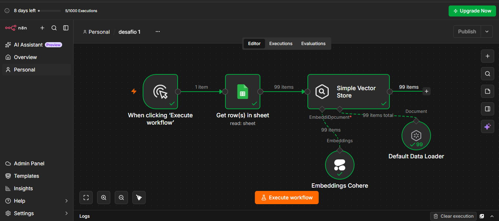
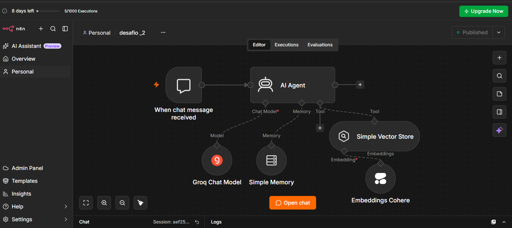
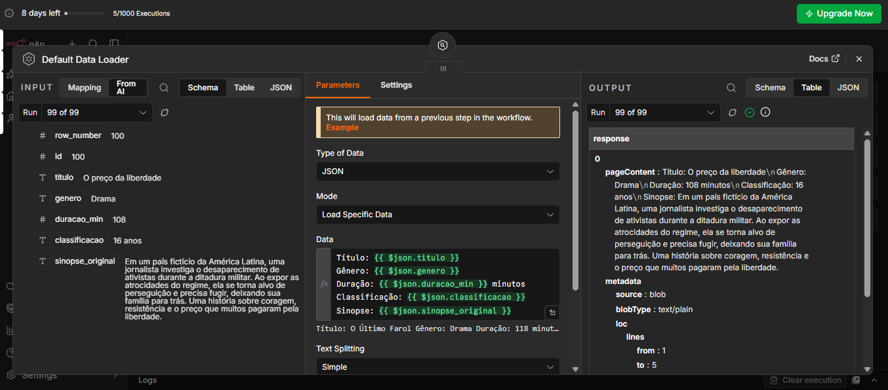
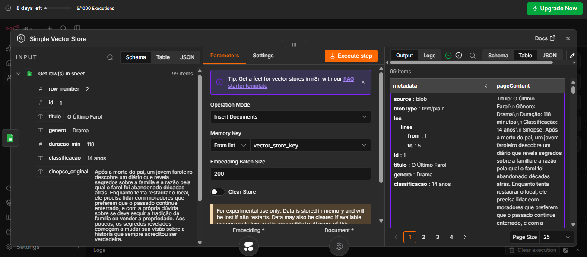
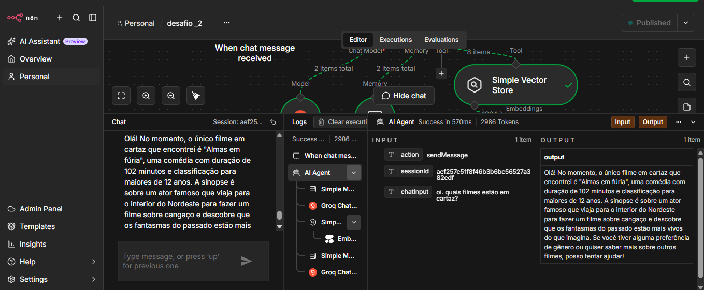

# 🎬 Luz & Cena - Agente Inteligente de Recomendação de Filmes (RAG + n8n)

Luz & Cena é um agente de IA Generativa capaz de consultar um catálogo de filmes em tempo real e responder a dúvidas dos usuários em linguagem natural, utilizando arquitetura RAG (Retrieval-Augmented Generation) no n8n.

---

## 📌 Sumário
- [Visão Geral](#-visão-geral)
- [Arquitetura da Solução](#-arquitetura-da-solução)
- [Tecnologias Utilizadas](#-tecnologias-utilizadas)
- [Como Funciona](#-como-funciona)
- [Como Executar o Projeto](#-como-executar-o-projeto)
- [Evidências e Demonstração](#-evidências-e-demonstração)
- [Autor](#-autor)

---

## 🚀 Visão Geral

O projeto consiste em um sistema de atendimento autônomo focado em cinema. A partir de uma base de conhecimento estruturada (planilha/CSV contendo catálogo de filmes, gêneros, durações, classificações e sinopses), o agente utiliza busca semântica para encontrar os filmes mais adequados à solicitação do usuário e formular respostas amigáveis.

### 🎯 Principais Funcionalidades
- **Busca Semântica:** Encontra filmes por gênero, tema, palavra-chave ou contexto, mesmo que a palavra exata não esteja no título.
- **Consultas Detalhadas:** Responde sobre sinopses, duração, classificação indicativa e recomendações personalizadas.
- **Memória Conversacional:** Mantém o contexto da conversa durante a sessão do usuário.
- **Interface Web:** Chat público acessível via navegador para interação direta do cliente.

---

## 🏗️ Arquitetura da Solução

O projeto é dividido em **dois workflows independentes** no n8n para otimizar o processamento e a manutenção:

[ Planilha / CSV ] ──> [ Default Data Loader ] ──> [ Cohere Embeddings ] ──> [ Simple Vector Store ]
│
▼
[ Usuário / Chat ] ──> [ Chat Trigger ] ──> [ AI Agent (Groq) ] <─────── [ Ferramenta de Busca ]
│
▼
[ Memória de Sessão ]

1. **Workflow de Ingestão (Pipeline de Dados):**
   - Lê a base de dados (Google Sheets / CSV).
   - Formata os atributos em texto contínuo via `Default Data Loader`.
   - Vetoriza as informações usando **Cohere Embeddings**.
   - Armazena as representações vetoriais no **Simple Vector Store** sob a chave `vector_store_key`.

2. **Workflow do Agente Inteligente (Interface & Atendimento):**
   - Recebe as mensagens via **Chat Trigger**.
   - Processa a intenção do usuário usando o LLM **Groq (Llama3/Groq)**.
   - Consulta o **Simple Vector Store** via *Tool Calling* (RAG) quando necessário.
   - Preserva o contexto da sessão usando **Simple Memory**.

---

## 🛠️ Tecnologias Utilizadas

- **Orquestração de Automação:** [n8n](https://n8n.io/) (n8n Cloud)
- **Modelo de Linguagem (LLM):** Groq (Chat Model)
- **Modelo de Embeddings:** Cohere (`embed-english-v3.0` / `embed-multilingual-v3.0`)
- **Banco de Dados Vetorial:** Simple Vector Store (LangChain/n8n)
- **Base de Conhecimento:** Google Sheets / CSV

---

## ⚙️ Como Executar o Projeto

### Pré-requisitos
- Conta no [n8n Cloud](https://n8n.io/) (ou instância local do n8n).
- Chave de API da **Groq**.
- Chave de API da **Cohere**.
- Acesso ao Google Sheets com a planilha de filmes.

### Passo a Passo

1. **Importar os Workflows:**
   - Faça o download dos arquivos JSON na pasta `workflows/` deste repositório.
   - No n8n, crie um novo workflow e selecione **Import from File** para importar o fluxo de ingestão e o fluxo do agente.

2. **Configurar Credenciais:**
   - Adicione suas credenciais da **Groq**, **Cohere** e **Google Sheets** no menu *Credentials* do n8n.

3. **Executar a Ingestão de Dados:**
   - Abra o **Workflow de Ingestão**.
   - Clique em **Execute Workflow** para ler a planilha e salvar os vetores no `Simple Vector Store`.

4. **Publicar o Agente:**
   - Abra o **Workflow do Chat**.
   - Abra o nó *When chat message received* e ative a opção **Make Chat Publicly Available**.
   - Clique no botão **Publish** no canto superior direito.
   - Copie a URL pública para interagir com o agente no navegador.

---

## 📸 Evidências e Demonstração

### 1. Workflows no n8n
* **Pipeline de Ingestão (Google Sheets ──> Vector Store):**
  

* **Agente de IA e Interface de Chat:**
  

### 2. Configuração dos Nós Principais
* **Configuração do Default Data Loader:**
  

* **Configuração do Simple Vector Store:**
  

### 3. Teste de Funcionamento (Linguagem Natural)
* **Atendimento em tempo real via Chat Público:**
  

---

## 🚀 Aplicação em Produção (Deploy)
O n8n está hospedado e rodando 24/7 na Oracle Cloud Instance:
- **URL do n8n:** http://163.176.33.131:5678

## 👤 Autor

Desenvolvido por **Sara Rosa dos Santos** como parte do desafio prático ONE IA.

- **LinkedIn:** https://www.linkedin.com/in/sara-rosa-20969242a/
- **GitHub:** https://github.com/srsantos532

