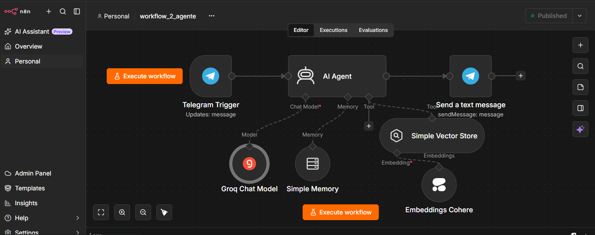
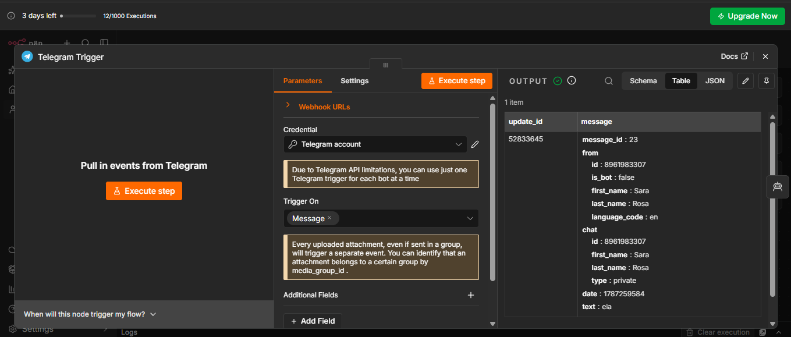
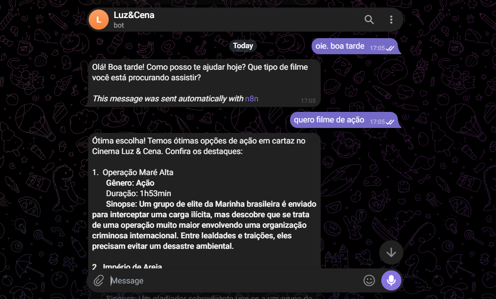

# 🎬 Luz&Cena - Agente Inteligente de Recomendação de Filmes (RAG + n8n + Telegram)

**Luz&Cena** é um agente de IA Generativa capaz de consultar um catálogo de filmes em tempo real e responder a dúvidas dos usuários em linguagem natural via **Telegram**, utilizando arquitetura RAG (*Retrieval-Augmented Generation*) no n8n.

---

## 📌 Sumário

* Visão Geral
* Principais Funcionalidades
* Arquitetura da Solução
* Tecnologias Utilizadas
* Como Executar o Projeto
* Evidências e Demonstração
* Deploy e Acesso ao Projeto
* Autor

---

## 🚀 Visão Geral

O projeto consiste em um sistema de atendimento autônomo focado em cinema. A partir de uma base de conhecimento estruturada (planilha/CSV contendo catálogo enriquecido com títulos, gêneros, durações, preços, diretores, notas e sinopses), o agente **Luz&Cena** utiliza busca semântica para encontrar os filmes mais adequados à solicitação do usuário e formular respostas amigáveis.

---

## 🎯 Principais Funcionalidades

* **Busca Semântica Completa:** Encontra filmes por gênero, tema, palavra-chave ou contexto, retornando detalhes como preços de ingressos, duração, nota e sinopse.
* **Orientação sobre Ingressos:** Informa sobre os valores dos ingressos e orienta o cliente sobre a necessidade de compra presencial na bilheteria do cinema.
* **Memória Conversacional:** Mantém o contexto do diálogo durante toda a sessão do usuário.
* **Atendimento Via Telegram:** Interface direta e acessível ao cliente final por meio de um bot autônomo.

---

## 🏗️ Arquitetura da Solução

O projeto é dividido em dois workflows independentes no n8n para otimizar o processamento e a manutenção:

```text
[ Planilha / CSV ] ──> [ Default Data Loader ] ──> [ Cohere Embeddings ] ──> [ Simple Vector Store ]
                                                                                   │
                                                                                   ▼
[ Usuário / Telegram ] ──> [ Telegram Trigger ] ──> [ AI Agent (Groq) ] <─────── [ Ferramenta de Busca ]
                                                          │
                                                          ▼
                                                [ Memória de Sessão ]

### Workflow de Ingestão (Pipeline de Dados)
* Lê a base de dados (Google Sheets / CSV).
* Formata os atributos e metadados enriquecidos (preço, nota, diretor, etc.) em texto contínuo via **Default Data Loader**.
* Vetoriza as informações usando **Cohere Embeddings**.
* Armazena as representações vetoriais no **Simple Vector Store**.

### Workflow do Agente Inteligente (Telegram & Atendimento)
* Recebe e escuta as mensagens dos clientes via **Telegram Trigger**.
* Processa a intenção do usuário usando o LLM **Groq (`openai/gpt-oss-120b`)** para otimização de resposta e controle de limites da API.
* Consulta o **Simple Vector Store** via Tool Calling (RAG) para obter dados em tempo real.
* Preserva o contexto da sessão usando **Simple Memory**.
* Retorna a resposta formatada para o chat do Telegram do usuário.

---

## 🛠️ Tecnologias Utilizadas

* **Orquestração de Automação:** n8n (Deploy em nuvem via OCI)
* **Canal de Comunicação:** Telegram Bot API (Luz&Cena)
* **Modelo de Linguagem (LLM):** Groq (`openai/gpt-oss-120b`)
* **Modelo de Embeddings:** Cohere (`embed-multilingual-v3.0` / `embed-english-v3.0`)
* **Banco de Dados Vetorial:** Simple Vector Store (LangChain/n8n)
* **Base de Conhecimento:** Google Sheets / CSV

---

## ⚙️ Como Executar o Projeto

### Pré-requisitos
* Instância do n8n (Local ou OCI).
* Chave de API da **Groq**.
* Chave de API da **Cohere**.
* Bot **Luz&Cena** criado no Telegram via `@BotFather` (Token de acesso).
* Acesso ao Google Sheets/CSV com o catálogo de filmes.

### Passo a Passo

1. **Importar os Workflows:**
   * Baixe os arquivos `.json` da pasta `workflows/` do repositório.
   * No n8n, crie um novo workflow e selecione **Import from File** para o fluxo de ingestão e para o fluxo do agente.

2. **Configurar Credenciais:**
   * Adicione suas credenciais do **Telegram Bot**, **Groq**, **Cohere** e **Google Sheets** no menu *Credentials* do n8n.

3. **Executar a Ingestão de Dados:**
   * Abra o Workflow de Ingestão (*Default Data Loader* + *Simple Vector Store*).
   * Clique em **Execute Workflow** para ler a planilha e popular a memória vetorial.

4. **Publicar o Bot no Telegram:**
   * Abra o Workflow do Agente.
   * Certifique-se de que o nó **Telegram Trigger** está configurado com as credenciais do bot **Luz&Cena**.
   * Ative o botão **Publish** no canto superior direito para manter o fluxo ativo 24/7.
   * Inicie uma conversa com o **Luz&Cena** no Telegram para interagir!

---

## 📸 Evidências e Demonstração


#### 1. Workflows no n8n
* **Pipeline de Ingestão (Google Sheets ──> Vector Store):**  
  

* **Agente de IA e Interface Telegram:**  
  

#### 2. Configuração dos Nós Principais
* **Configuração do Default Data Loader:**  
  

* **Configuração do Telegram Trigger:**  
  

* **Configuração do Simple Vector Store:**  
  

#### 3. Teste de Funcionamento (Linguagem Natural)
* **Atendimento em Tempo Real via Telegram (Luz&Cena):**  
  

---

## 🚀 Deploy e Acesso ao Projeto

A aplicação está rodando em uma instância da Oracle Cloud Infrastructure (OCI) via Docker.

- **Painel de Workflows:** [Acessar n8n em Produção](http://163.176.33.131:5678/home/workflows)
- **URL Base:** `http://163.176.33.131:5678/`

## 👤 Autor

Desenvolvido por **Sara Rosa dos Santos** como parte do desafio prático ONE IA.

- **LinkedIn:** https://www.linkedin.com/in/sara-rosa-20969242a/
- **GitHub:** https://github.com/srsantos532

